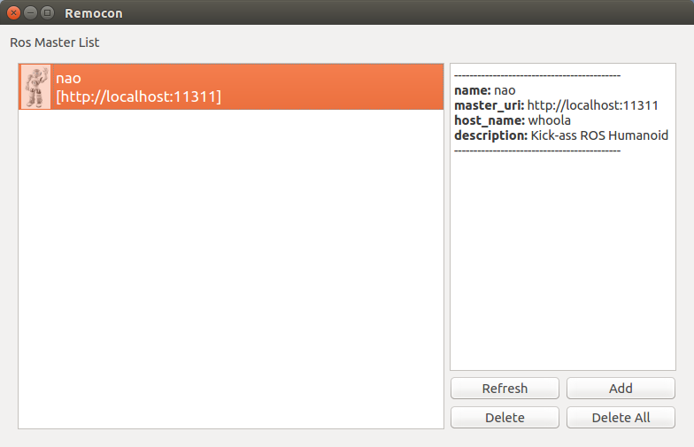

# Rocon Nao

This helps to control nao with rocon app system.

## Installation

1. Install NaoQI python by following guide.  note that PYTHONPATH need to be updated as well.

[NaoQI Python Install Guide](http://doc.aldebaran.com/1-14/dev/python/install_guide.html)

2. Install nao ros packages

```
> sudo apt-get install ros-indigo-nao*
```

3. Install rocon app platform

[Rocon App Platform Installation](http://wiki.ros.org/rocon_app_manager/Tutorials/indigo/Install Rocon App Manager)

4. Setup Rocon Nao workspace with rocon_nao repository

Github : https://github.com/robotics-in-concert/rocon_robots/tree/nao 

## Execution

1. Nao Bringup

```
> export NAO_IP=<NAO_IP>
> roslaunch rocon_nao standalone.launch # or concert_client.launch for concert mode
```

2. Access with Remocon

```
> rocon_remocon (or rqt_remocon)
```



